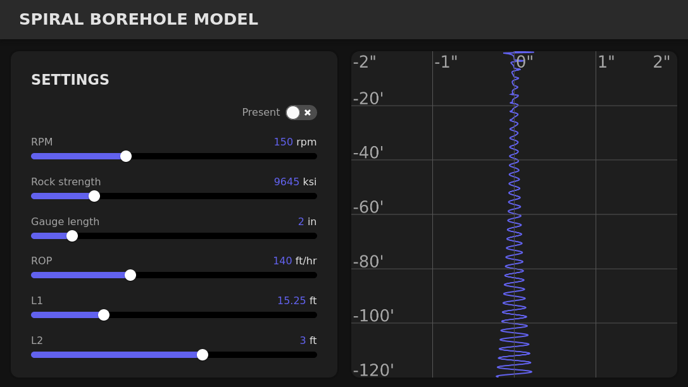

# Bottom Hole Pattern Feedback Model

Model: Paul Pastusek ([SPE84448](https://onepetro.org/SPEATCE/proceedings-abstract/03ATCE/All-03ATCE/SPE-84448-MS/137797))

Implementation: Daniel Dupriest

License: MIT

Demo Installation: [dev.hypersweet.com/bhpfm/](http://dev.hypersweet.com/bhpfm/)

This application simulates borehole oscillations under various conditions. Parameters such as RPM, rock strength, gauge length and ROP can be specified, and the resulting oscillation is rendered

